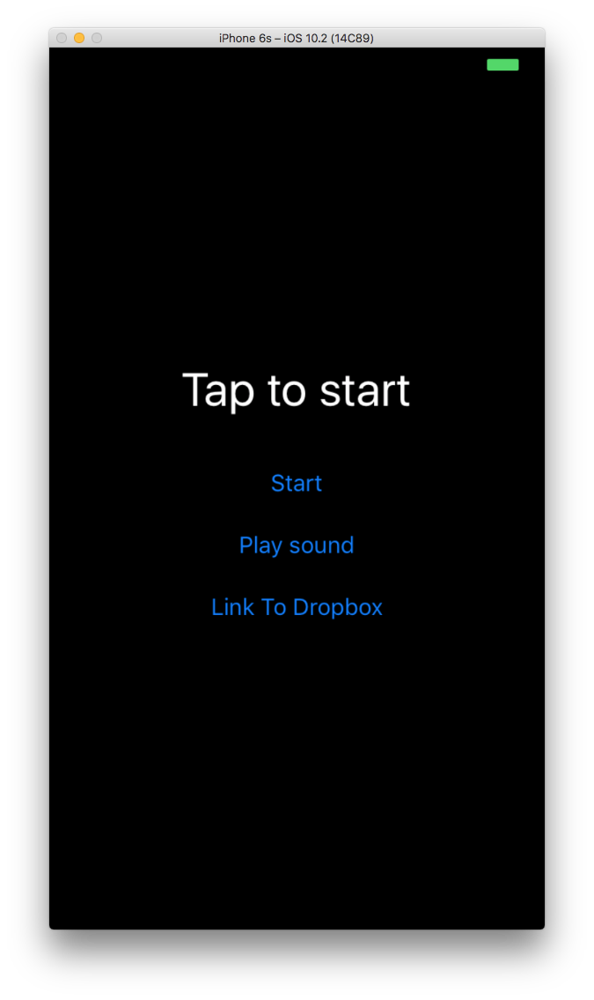

Motion Dropbox Example
=========

This RubyMotion app for iOS demonstrates how to use official Dropbox API
v2 SDK.  It records a sound, asks to give a filename and then uploads
the wav to your dropbox directory.

Step 1: register your app in dropbox
Step 2: ```bundle install```
Step 3: ```rake pod:install```
Step 4: ```DROPBOX_KEY=<YOUR_DROPBOX_KEY> rake```



Initial credits go to: https://github.com/xavriley/EasyRecorder
